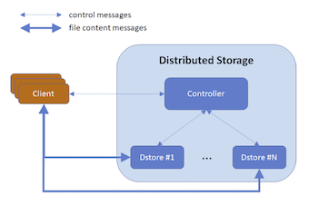
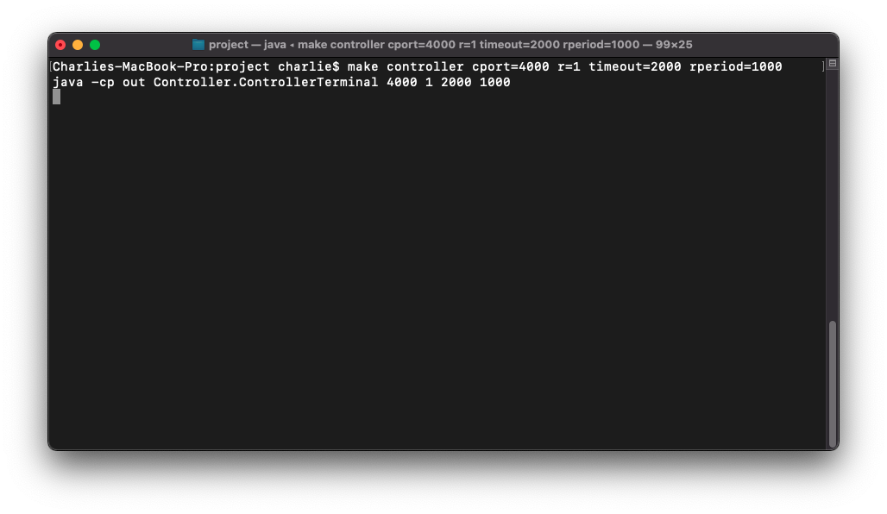
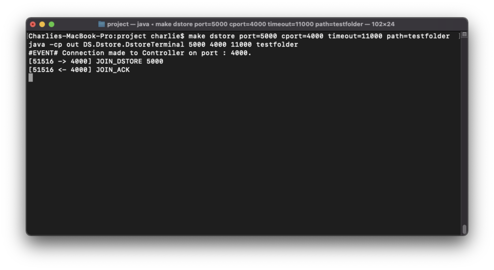
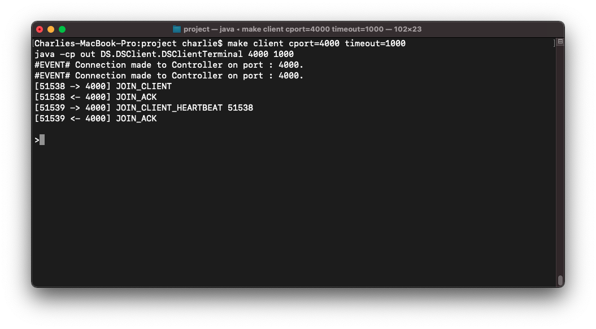
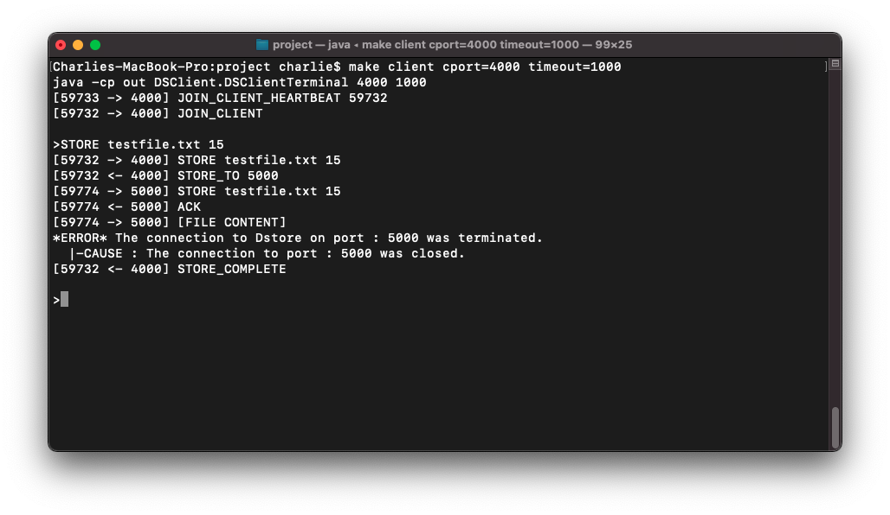
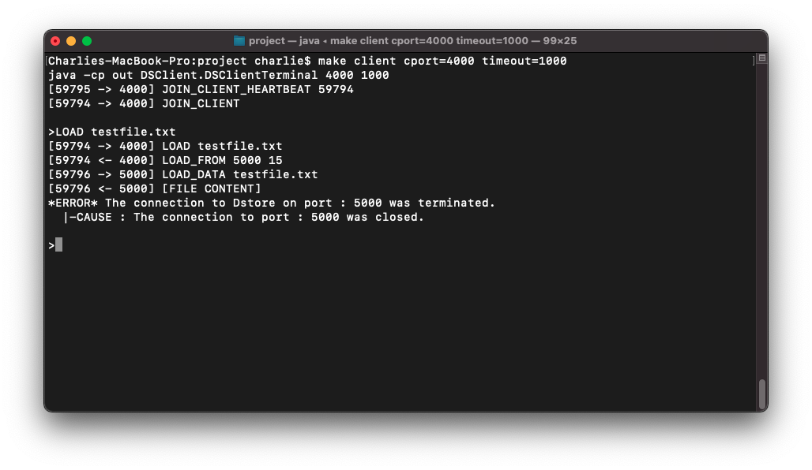
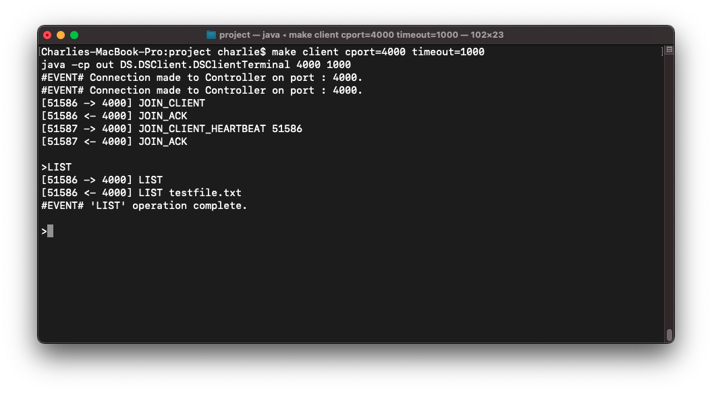
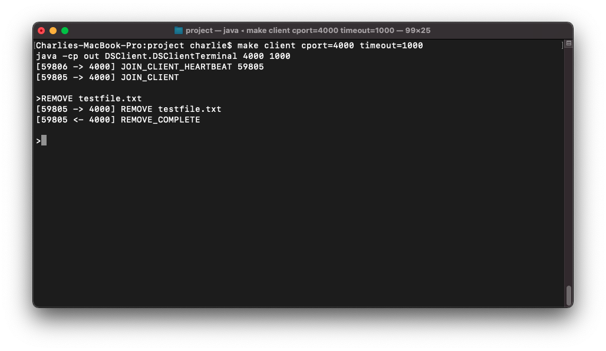
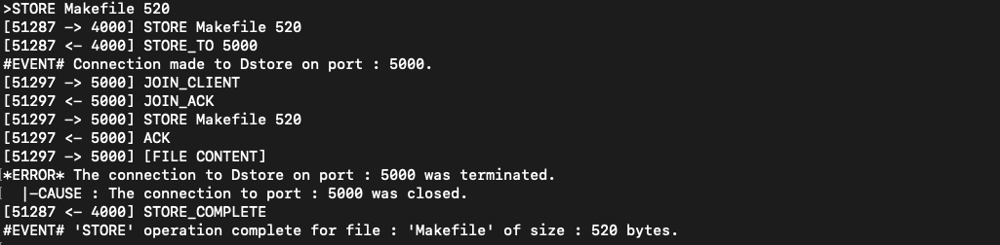

# Distributed File Storage System

## COMP2207: Distributed Systems and Networks

---

### System Overview

#### Task Description

- Develop a distributed file storage system that can handle concurrent client requests using Java Sockets.
- For simplicity reasons, the processes all occur on the same machine, running on different ports.

#### Network Structure

- The **Distributed File Storage System** is made-up of three components:
  - **Controller** : The server within the system - takes requests from clients and handles them accordingly.
  - **Dstore** : A data store unit that is connected to the system via the controller. Dstores recieve commands from the controller and store files accordingly.
  - **Client** : A client that makes use of the system. The client sends requests to the Controller which are handeled accordingly.

<p align="center"></p> 

#### Network Workflow


- The system has one **Controller** and N Data Stores (**Dstore**s) that can connect and leave at any time.
- Clients can join the system by connecting to the Controller, and send in requests to manage the stored files.
- The system supports multiple concurrent **Client**s sending **STORE**, **LOAD**, **LIST** and **REMOVE** requests. 
  - `STORE` : Used to store a new file onto the system.
  - `LOAD` : Used to gather a file stored on the system.
  - `LIST` : Used to gather a list of all files stored on the system.
  - `REMOVE` : Used to remove a file from the system.
- When storing files, the Controller selects R (*run-time parameter*) of the N connected Dstores to replicate the file across. The Controller will select the R Dstores such that all files are spread evenly across all Dstores (i.e., the same R Dstores are not chosen every time).

  - *In order to service any client request,, at least **R** Dstores must be connected to the Controller.*
- The client sends/recieves files directly to/from Dstores - which makes the system very scalable.
- The system is able to adapt to new Dstores joining and old Dstores leaving using **Reblancing**.


- Files in the system are not organised in folders and/or sub-folders and filenames do not contain spaces.

##### Network Protocol

- Refer to `specification.pdf` for a detailed description of the network protocol used within the system (i.e., information on how operations are handeled and what messages are sent between processes).
- **Concepts not detailed in the specification but present in this system (personal additions):**
  - Client's connect to Controllers and Dstores with `CLIENT_JOIN` messages, and wait for a `JOIN_ACK` to be recieved before proceeding. *This was done so that the Controller and Dstores could keep track of active Client connections*.
  - The system will log the transfer of **file content** in addition to control messages that are sent (see [Logging: Messages](#Messages)). *This was done for convenience*.
  - The Client maintains a secondary connection to the Controller called the **Client Heartbeat**. *This was done so that the Client is able to detect the Controller disconnecting/terminating*.
  - The system uses records the occurance of **Events** and **Errors** (see [Logging](#Logging)).*This was done for convenience*.

#### Failure Tolerance

- The system uses **Rebalancing** to ensure that all files are evenly replicated over R Dstores despite new Dstores joining the system and old Dstores failing.
- Periodically (*determined by run-time parameters*), the **Controller** will audit the connected Dstores to acquire the list of files they are storing.
- From these lists, the Controller will calculate if, and how fiiles need to be redistributed across the Dstores such that every file is replicated R times, and that files are evenly spread.
- In the case where rebalancing is required, the Controller will send control messages to the Dstores informing them of the files they must remove/where they should send files to such that the system becomes balanced.
- After a rebalance has completed, it is true that all files will be replicated across the Dstores R times, and that all files are evenly spread across Dstores.
- Detailed information on the Rebalancing process is provided in `specification.pdf`.

---

### Running the Application

- Contained in `/build` are **executable** `.jar` files which can be used to run each system component.

> **<u>NOTE:</u>** 
>
> - The Controller must be started **first** (as Client and Dstore must be able to connect to the Controller to start).
> - If the Controller is closed, all Clients and Dstores that were connected to it will also close (as they canont function without an active Controller).

#### Controller

- When in the same directory as `Controller.jar`, use the following command to **start a Controller process**:

  - ```bash
    java -jar Controller.jar <CPORT> <R> <TIMEOUT> <RPERIOD>
    ```

- Where:

  - `CPORT` : The **port** that the Controller will be run on (the port it will listen for requests on).
  - `R` : The **replication factor** - the number of Dstores across which all files will be replicated onto.
    - The controller will not serve requests from clients unless at least `R` Dstores are currently connected.
  - `TIMEOUT` : The **timeout** period for requests sent by the Controller to Clients/Dstores.
  - `RPERIOD` : The **rebalance period** - the length of time between rebalancing operations.



#### Dstore

- When in the same directory as `Dstore.jar`, use the following command to **start a Dstore process**:

  - ```bash
    java -jar Dstore.jar <PORT> <CPORT> <TIMEOUT> <PATH>
    ```

- Where:

  - `PORT` : The **port** the Dstore will listen for communication on (the port it will listen for requests on).
  - `CPORT` : The **port the Controller** is running on.
  - `TIMEOUT` : The **timeout** period for requests sent by the Dstore to the Controller/Clients.
  - `PATH` : The **path** (relative or absolute) for where the Dstore will store the files it recieves from clients (new directory created if one does not exist).



#### Client

- When in the same directory as `DSClient.jar`, use the following command to **start a DSClient process**:

  - ```bash
    java -jar DSClient.jar <CPORT> <TIMEOUT>
    ```

- Where:

  - `CPORT` : The **port the Controller** is running on.
  - `TIMEOUT` : The **timeout** period for requests sent by the Client to the Controller/Dstores.



---

### Usage

- Commands are input via the **command line interface** on the **Client process**.
- Any file can be referenced as a **relative** or **absolute path**, and must include the **file extension**.

#### STORE

- The **STORE** command has the following syntax:

```assembly
STORE <filename> <filesize>
```

- Where:
  - `filename` : The **path** to the file to be stored.
  - `filesize` : The **size** of the file in bytes.



#### LOAD

- The **LOAD** command has the following syntax:

```assembly
LOAD <filename>
```

- Where:
  - `filename` : The **name** of the file being loaded.



#### LIST

- The **LIST** command has the following syntax:

```assembly
LIST
```



#### REMOVE

- The **REMOVE** command has the following syntax:

```assembly
REMOVE <filename>
```

- Where:
  - `filename` : The **name** of the file to be removed.



---

### Logging

- Various information will be **logged** in the terminal of each component (Controller, Client, Dstore) whilst the system is in operation and requests are being served.

#### Messages

- Controllers, Clients and Dstores will log **messages** they **send/recieve** to/from other processes.
- The structure of a **Message Log** is as follows:

``` 
[ <currentPort> -> / <-  <otherPort>] <content>
```

- Where:

  - `currentPort` : The port of the process runing in the terminal.
  - ` -> / <- ` : Indicates if the message in question was sent or receieved respectivley.
  - `otherPort` : The port of the other process involved in the communication (where the message was sent to/receieved from).
  - `content` : The content within the message that was sent/receieved.

- Examples:

  - ```
    [4000 <- 5000] STORE sampleFile.txt 30
    ```

    - Means that the message `STORE sampleFile.txt 30` was sent from a process received by a process on port `4000` from a process on port `5000`.

  - ```
    [4000 -> 5000] STORE_COMPLETE
    ```

    - Means that the message `STORE_COMPLETE` was sent from a process on port `4000` to a process on port `5000`.

- Sample output:


#### Events

- Controllers, Clients and Dstores will log  the occurance of **pre-defined events** within the system.
- The structure of an **Event Log** is as follows:

```
#EVENT# <content>
```

- Where:

  - `content` : A description of the event.

- The types of event that can occur are as follows:

  - **Operation Completion Event** : Displayed when an system operation (e.g., storing a file) has been completed.

    - Example:

      - ```
        #EVENT# 'STORE' operation complete for file : 'Makefile' of size : 520 bytes.
        ```

  - **Client Connection Event**: The event of a network client (i.e., Client or Dstore) connecting to a server (i.e., Controller or Dstore).

    - Example:

      - ```
        #EVENT# Connection made to Controller on port : 4000.
        ```

  - **Server Connection Event**: The event of a server (i.e., Contrroller or Dstore) receieving a connectio from a client (i.e., Client or Dstore).

    - Example:

      - ```
        #EVENT# New Client connected on port : 49691.
        ```

#### Errors

- Controllers, Clients and Dstores will log the occurance of **errors** during the systems operation. 
- Errors are output with an **error message** (detailing what error has occured) and a **cause trace** (detailing why the error has occured).
- The structure of an **Error Log** is as follows:

```
*ERROR* <Error Message>
	|-CAUSE : <Cause Message>
	|-CAUSE : <Cause Message>
	...
```

- Where:

  - `Error Content` :  A description of the error that has occured.
  - `Cause Content` : A reason for why the error (or cause) has occured. 

- The system will report on wide variety of errors - examples include:

  - **Not Enough Dstores Connected Error** : Occurs when the Controller is not able to process a Client request as not enough Dstores are connected to the system.

    - ```
      *ERROR* Unable to handle request 'LIST'.
        |-CAUSE : Not enough Dstores are present in the system.
      ```

  - **File Already Exists** : Occurs when the Client requests to store a file which is already stored in the system.

    - ```
      *ERROR* Unable to handle request 'STORE Makefile 520'.
        |-CAUSE : A file with the name 'Makefile' already exists.
      ```

  - **File Does Not Exist** : Occurs when the Client requests to load/remove a file that does not exist in the system.

    - ```
      *ERROR* Unable to handle request 'LOAD testfile'.
        |-CAUSE : The file 'testfile' does not exist.
      ```

##### NOTE

- One of the system errors is for a **connection disconnection**.

- This error occurs when the communication channel between two processes is terminated.

- For example:

  - ```
    *ERROR* The connection to Client on port : 51297 was terminated.
      |-CAUSE : Unable to receive message from port : 51297
      |-CAUSE : The connector on port : 51297 disconnected.
    ```

- This error occurs when a process (e.g., Client or Dstore) disconnects from another process.

- Due to the workflow of the network, there are two instances where this error will naturally occur.

  - **First:**
    - When storing a file, the Client will connect to R Dstores, send the file, and disconnect from them (as the communication channel is no longer required once the file has been sent).
    - As such, the Dstores will log the error that the Client has disconnected, and the Client will log the error that the Dstore has disconnected.
    - While these are technically errors, this is expected behaviour provided the disconnect occured **after the operation had completed**.
    - Sample output:

  

  - **Second:**
    - When reblanacig is being carried out, Dstores will connect to other Dstores, share files, and disconnect from eachother.
    - As such, Dstores will log the error that the Dstores that were connected to them have disconnected.
    - While these are technically errors, this is expected behaviour provided the disconnect occured **after the operation had completed**.

- Alterenativley, instances such as the Controller reporting that a Client/Dstore has disconnected or a Client disconnecting from a Dstore mid-transfer are errornous - this behaviour should not occur during the standard workflow of the system.

---

### Compilation guide

- The provided `Makefile` can be used for compilation of the application.

#### Compilation

- Recompile the application with:

  - ``` bash
    make compile
    ```

  - The compiled `.class` files will be placed into a directory called `out`.

#### Controller

##### Running

- Use the following commands to run a Controller process (after compiling):

``` bash
make run-controller cport=<CPORT> r=<R> timeout=<TIMEOUT> rperiod=<RPERIOD>
```

- Where:
  - `CPORT` : The **port** that the Controller will be run on (the port it will listen for requests on).
  - `R` : The **replication factor** - the number of Dstores across which all files will be replicated onto.
    - The controller will not serve requests from clients unless at least `R` Dstores are currently connected.
  - `TIMEOUT` : The **timeout** period for requests sent by the Controller to Clients/Dstores.
  - `RPERIOD` : The **rebalance period** - the length of time between rebalancing operations.

##### Building

- Use the following command to **build** `Controller.jar`:

  - ```bash
    make build-controller
    ```

  - The `Controller.jar` file will be placed into `build`.

#### Dstore

##### Running

- Use the following commands to run a Dstore process (after compiling):

``` bash
make dstore port=<PORT> cport=<CPORT> <TIMEOUT> path=<PATH>
```

- Where:
  - `PORT` : The **port** the Dstore will listen for communication on (the port it will listen for requests on).
  - `CPORT` : The **port the Controller** is running on.
  - `TIMEOUT` : The **timeout** period for requests sent by the Dstore to the Controller/Clients.
  - `PATH` : The **path** (relative or absolute) for where the Dstore will store the files it recieves from clients (new directory created if one does not exist).

##### Building

- Use the following command to **build** `Dstore.jar`:

  - ```bash
    make build-dstore
    ```

  - The `Dstore.jar` file will be placed into `build`.

#### Client

##### Running

- Use the following commands to run a Dstore process (after compiling):

``` bash
make client cport=<CPORT> timeout=<TIMEOUT>
```

- - Where:
    - `CPORT` : The **port the Controller** is running on.
    - `TIMEOUT` : The **timeout** period for requests sent by the Client to the Controller/Dstores.
- Requests are input into the Client terminal after the `>`.

##### Building

- Use the following command to **build** `Dsclient.jar`:

  - ```bash
    make build-client
    ```

  - The `DSClient.jar` file will be placed into `build`.

---